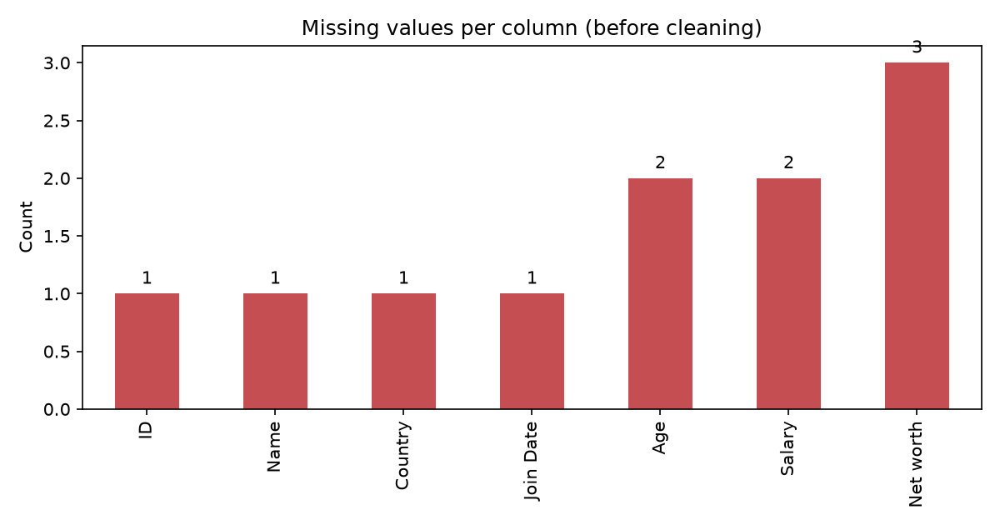
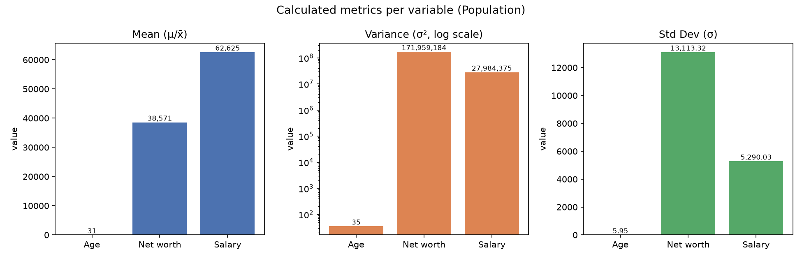
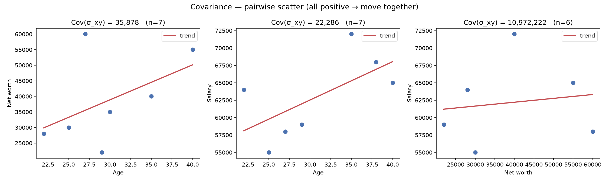

# Data Analysis Report — Sample Dataset

Generated by `analysis.py` from `Sample_dataset.csv`.

## 1. Data Import

- Records loaded: **10** rows × **7** columns.
- Columns: `ID, Name, Age, Net worth, Country, Salary, Join Date`

Raw data preview (first 5 rows):

|   ID | Name    | Age          |   Net worth | Country   |   Salary | Join Date   |
|-----:|:--------|:-------------|------------:|:----------|---------:|:------------|
|    1 | Alice   | 25           |      30,000 | NZ        |    55000 | 15/01/2020  |
|    2 | Bob     |              |             | NZ        |    60000 | 20/02/2020  |
|    2 | Bob     | 30           |       35000 | NZ        |          | 20/02/2020  |
|    4 | Charlie | 35           |       40000 | AUS       |    72000 |             |
|    5 | David   | thirty-eight |             | NZ        |    68000 | 1/11/2019   |

## 2. Data Cleaning

### 2.1 Missing values (before cleaning)

| Column    |   Missing |   Missing % |
|:----------|----------:|------------:|
| ID        |         1 |          10 |
| Name      |         1 |          10 |
| Age       |         2 |          20 |
| Net worth |         3 |          30 |
| Country   |         1 |          10 |
| Salary    |         2 |          20 |
| Join Date |         1 |          10 |

### 2.2 Cleaning transformations applied

| Column    | Raw value           | Cleaned   | Action                      |
|:----------|:--------------------|:----------|:----------------------------|
| Age       | thirty-eight        | 38        | word number → numeric       |
| Net worth | 30,000              | 30,000    | removed thousands separator |
| Salary    | sixty five thousand | 65,000    | word number → numeric       |
| Country   | AU                  | AUS       | standardised country code   |
| Join Date | 2019-13-01          | (missing) | invalid date dropped        |

### 2.3 Effective sample sizes after cleaning

| Variable | n |
|---|---:|
| Age | 8 |
| Net worth | 7 |
| Salary | 8 |

### 2.4 Cleaned dataset (after cleaning)

| ID | Name | Age | Net worth | Country | Salary | Join Date |
|---:|---|---:|---:|---|---:|---|
| 1 | Alice | 25 | 30,000 | NZ | 55,000 | 2020-01-15 |
| 2 | Bob |  |  | NZ | 60,000 | 2020-02-20 |
| 2 | Bob | 30 | 35,000 | NZ |  | 2020-02-20 |
| 4 | Charlie | 35 | 40,000 | AUS | 72,000 |  |
| 5 | David | 38 |  | NZ | 68,000 | 2019-11-01 |
|  | Eve | 29 | 22,000 | AUS | 59,000 |  |
| 7 |  | 40 | 55,000 | NZ | 65,000 | 2018-05-30 |
| 8 | Grace | 22 | 28,000 |  | 64,000 | 2021-07-25 |
| 9 | Heidi |  |  | AUS |  | 2021-07-25 |
| 10 | Ivan | 27 | 60,000 | NZ | 58,000 | 2019-03-15 |

## 3. Calculated Metrics

### 3.1 Mean / Variance / Std Dev

| Variable | N | Mean (μ/x̄) | Variance σ² (/N) | Std Dev σ | Sample Var S² (/n) | Sample SD S |
|---|---:|---:|---:|---:|---:|---:|
| Age | 8 | 30.75 | 35.44 | 5.9529 | 35.44 | 5.9529 |
| Net worth | 7 | 38571.43 | 171959183.67 | 13113.3208 | 171959183.67 | 13113.3208 |
| Salary | 8 | 62625.00 | 27984375.00 | 5290.0260 | 27984375.00 | 5290.0260 |

### 3.2 Covariance

| Pair | n | Covariance σ_xy (/N) | Covariance S_xy (/(n−1)) |
|---|---:|---:|---:|
| Age ↔ Net worth | 7 | 35877.55 | 41857.14 |
| Age ↔ Salary | 7 | 22285.71 | 26000.00 |
| Net worth ↔ Salary | 6 | 10972222.22 | 13166666.67 |

## 4. Notes

- Population (N) = the whole column; Sample (n) = the observed values.
- As written in the lecture screenshot, the sample variance S² divides by n
  (same as σ²); the usual unbiased estimator divides by (n−1) (Bessel's correction).
- Sample covariance S_xy divides by (n−1).
- Single-variable stats use that column's non-missing values; covariance uses
  only the rows where BOTH variables are present.
