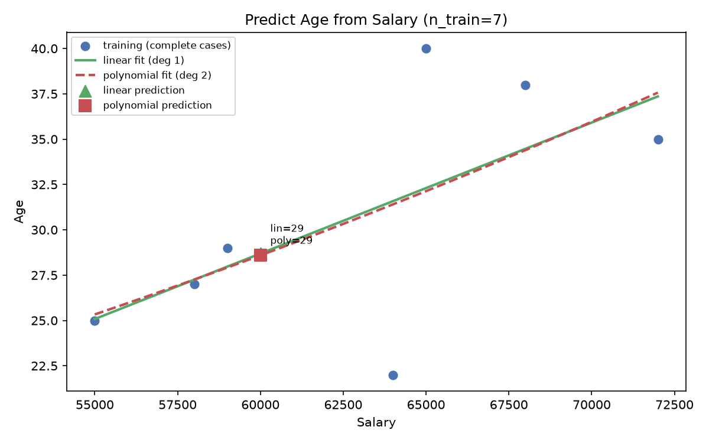
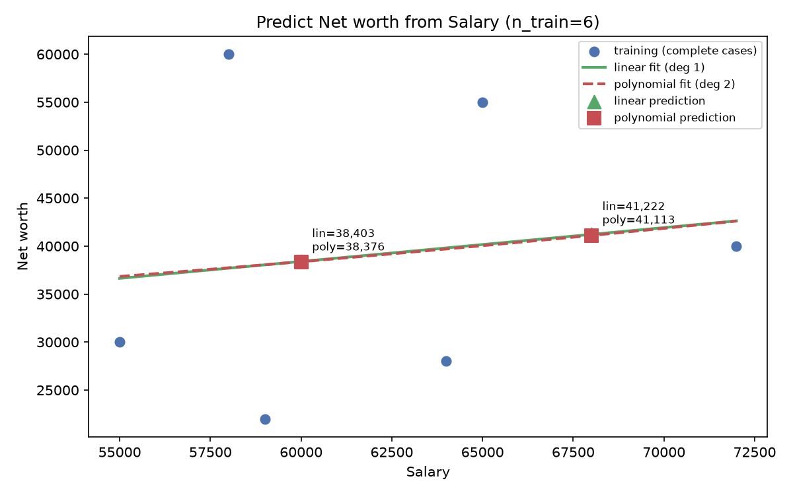
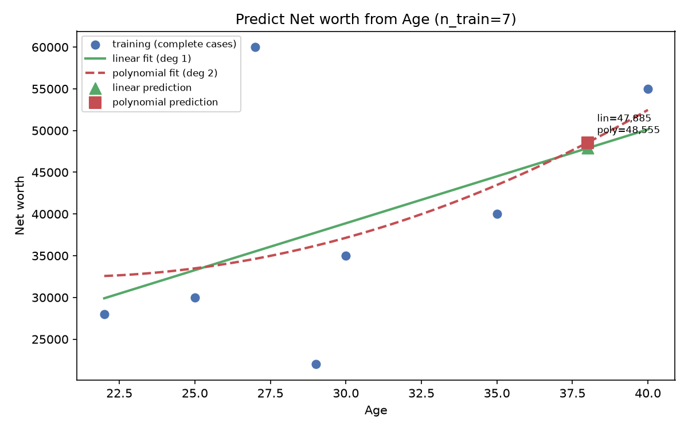
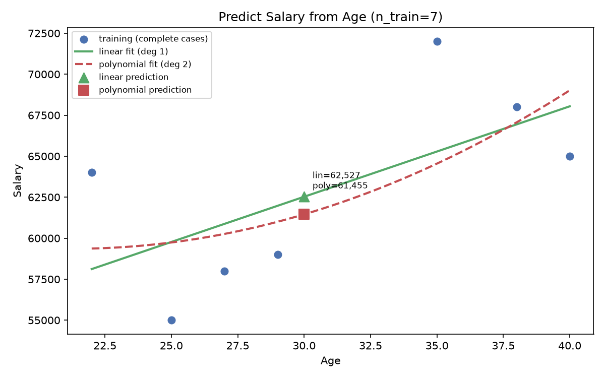
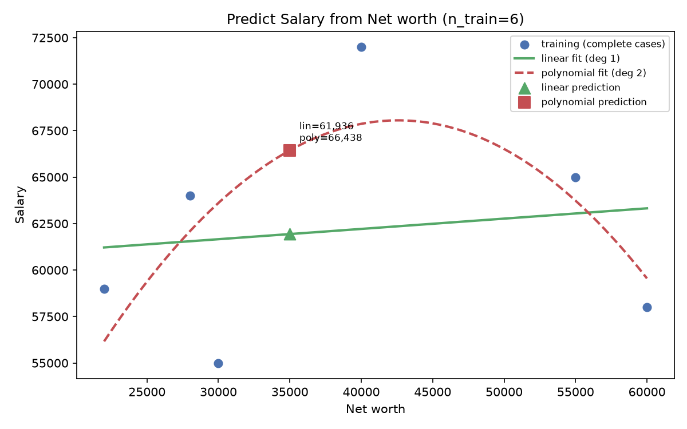

# Week 3 Activity 2 — Missing Value Prediction

Data source: cleaned dataset from Activity 1 (10 records).

## 1. Missing values to predict

| Column | Missing rows | Predictable? |
|---|---|---|
| Age | Bob (ID=2), Heidi (ID=9) | Bob: yes (has Salary); Heidi: no (no predictor) |
| Net worth | Bob (ID=2), David (ID=5), Heidi (ID=9) | Bob/David: yes; Heidi: no |
| Salary | Bob (ID=2), Heidi (ID=9) | Bob: yes; Heidi: no |

Heidi has **no** numeric predictor values, so her cells cannot be
estimated by regression and stay missing.

For Bob, the two duplicate ID=2 records are complementary (one has
`Salary=60000`, the other `Age=30, Net worth=35000`), so merging them
**retrieves** his missing values directly — these act as ground truth
to cross-check the regression predictions.

## 2. Method

For each (target, predictor) pair, the model is trained on the rows
where **both** values are present, then used to predict the rows where
the target is missing. Two models are compared (per the sample code):
- **Linear regression** — `LinearRegression` (degree 1).
- **Polynomial regression** — `LinearRegression` on `PolynomialFeatures(degree=2)`.

## 3. Model fit per task

| Task | n_train | Model | MSE | RMSE | R² |
|---|---|---|---|---|---|
| Age ~ Salary | 7 | Linear | 24.31 | 4.93 | 0.3983 |
| Age ~ Salary | 7 | Polynomial deg 2 | 24.46 | 4.95 | 0.3946 |
| Net worth ~ Salary | 6 | Linear | 194,272,673.21 | 13,938.17 | 0.0195 |
| Net worth ~ Salary | 6 | Polynomial deg 2 | 194,542,367.18 | 13,947.84 | 0.0182 |
| Net worth ~ Age | 7 | Linear | 131,631,348.19 | 11,473.07 | 0.2345 |
| Net worth ~ Age | 7 | Polynomial deg 2 | 128,774,096.99 | 11,347.87 | 0.2511 |
| Salary ~ Age | 7 | Linear | 18,566,233.77 | 4,308.86 | 0.3983 |
| Salary ~ Age | 7 | Polynomial deg 2 | 17,936,839.02 | 4,235.19 | 0.4187 |
| Salary ~ Net worth | 6 | Linear | 30,531,286.51 | 5,525.51 | 0.0195 |
| Salary ~ Net worth | 6 | Polynomial deg 2 | 17,820,755.76 | 4,221.46 | 0.4277 |

## 4. Predicted missing values (linear vs polynomial)

| Target | Row | Predictor value | Linear prediction | Polynomial prediction | Retrieved / true value |
|---|---|---:|---:|---:|---:|
| Age | Bob (ID=2) | 60,000 | 28.69 | 28.59 | 30 |
| Net worth | Bob (ID=2) | 60,000 | 38,403.21 | 38,376.02 | 35,000 |
| Net worth | David (ID=5) | 68,000 | 41,222.12 | 41,112.78 | — |
| Net worth | David (ID=5) | 38 | 47,884.91 | 48,555.21 | — |
| Salary | Bob (ID=2) | 30 | 62,527.27 | 61,455.36 | 60,000 |
| Salary | Bob (ID=2) | 35,000 | 61,935.93 | 66,437.57 | 60,000 |

> **Note:** the final filled dataset (`predicted_data.csv`) uses the **linear** predictions (recommended for stability on this small sample); the polynomial predictions are shown here for comparison.

## 5. Visualisations

### Age From Salary

### Net Worth From Salary

### Net Worth From Age

### Salary From Age

### Salary From Net Worth

## 6. Comparison & conclusion

- Average in-sample R²: **linear 0.2140** vs **polynomial 0.3021**.
- Polynomial fits the training data better in-sample, but with only 6–7 training points a degree-2 model (3 parameters) is prone to **overfitting**.
- **Cross-check on Bob** (comparing each model's prediction to the retrieved true value):
  - Age (true 30) from Salary: linear error 1.3 vs polynomial error 1.4 → **linear** closer.
  - Net worth (true 35,000) from Salary: linear error 3,403.2 vs polynomial error 3,376.0 → **polynomial** closer.
  - Salary (true 60,000) from Age: linear error 2,527.3 vs polynomial error 1,455.4 → **polynomial** closer.
  - Salary (true 60,000) from Net worth: linear error 1,935.9 vs polynomial error 6,437.6 → **linear** closer.

- **David's Net worth** has no ground truth; the two predictors give a wide range (≈ 41,000–49,000), so treat it as a rough estimate with **low confidence**.
- **Recommendation:** with only 6–7 training points and weak relationships (many R² ≈ 0.02–0.42), neither model is clearly better. Prefer the **linear** model for stability; when available, use the **retrieved** value from duplicate records (Bob) as the most reliable. Use polynomial predictions only if they agree with the linear ones.
